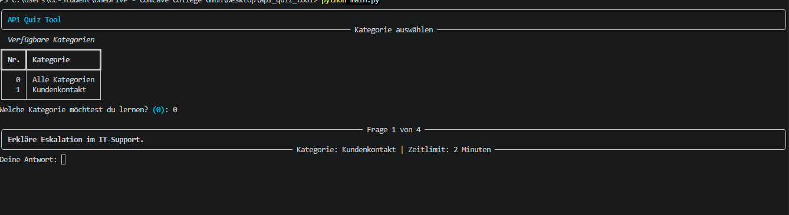

AP1 Quiz Tool

Dieses Projekt ist während meiner Umschulung zur Fachinformatikerin für Systemintegration entstanden. Ziel war es, ein eigenes Lernsystem für die AP1 Prüfung zu entwickeln, das nicht nur Fragen stellt, sondern auch beim Verstehen hilft.

Das Tool existiert in zwei Varianten:
eine Terminal-Version für schnelles Lernen und eine Web-Version mit moderner Oberfläche.

Live Demo
https://ap1-quiz-tool.onrender.com

Funktionen

Lernen nach Kategorien wie BWL, Netzwerke, Hardware oder Qualitätsmanagement
Multiple Choice Fragen und offene Fragen
Auswertung von Freitextantworten über Schlüsselbegriffe statt exaktem Wortvergleich
Direkte Rückmeldung nach jeder Antwort
Erklärungen zu jeder Frage für besseres Verständnis
Speicherung von Fehlern zur gezielten Wiederholung
Lernstandsanalyse mit Auswertung nach Kategorien
Weboberfläche mit Navigation, Kategorienauswahl und Fortschrittsanzeige

Technologien

Python
Flask
SQLite
HTML und CSS
Rich (für die Terminal-Version)

Funktionsweise

Die Fragen werden in einer SQLite Datenbank gespeichert und beim Start geladen.
Bei Multiple Choice wird die Auswahl direkt geprüft.
Bei offenen Fragen wird anhand definierter Schlüsselbegriffe bewertet, ob die Antwort inhaltlich korrekt ist.

Alle beantworteten Fragen werden in der Datenbank gespeichert.
Dadurch kann der Lernfortschritt ausgewertet und die schwächsten Themenbereiche erkannt werden.

Projektstruktur

app.py Webanwendung mit Flask
main.py Terminalversion des Quiz
database.py Erstellung und Befüllung der Datenbank
templates HTML Seiten für die Weboberfläche
static CSS Styling
questions.db SQLite Datenbank

Start lokal

python database.py
python main.py

oder für die Webversion

python app.py

Dann im Browser öffnen:
http://127.0.0.1:5000

Screenshot

Hier ein Beispiel der Anwendung im Einsatz

(screenshot.png einfügen)

Ziel des Projekts

Das Projekt zeigt, wie ich Inhalte aus der Umschulung praktisch umsetze und eigenständig erweitere.
Der Fokus lag nicht nur auf Funktionalität, sondern darauf, ein sinnvolles Lernsystem zu entwickeln, das realen Nutzen hat.

Weiterentwicklung

Ausbau der Weboberfläche
Grafische Darstellung des Lernfortschritts
Benutzerkonten mit individuellem Fortschritt
Erweiterung der Fragensammlung
Deployment mit externer Datenbank
